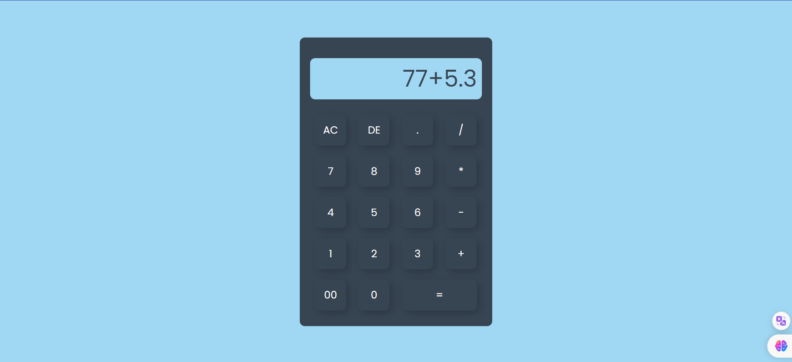

# Simple Calculator

A basic calculator web application built using HTML, CSS, and JavaScript.

## Table of Contents

- [Features](#features)
- [How to Use](#how-to-use)
- [Contributing](#contributing)
- [License](#license)

## Features

- Addition, subtraction, multiplication, and division functionalities.
- Lightweight and easy to understand codebase.

## How to Use

1. **Clone the Repository:**
   ```bash
   git clone https://github.com/your-username/simple-calculator.git
   cd simple-calculator
   ```

2. **Open the Application:**
   - Open `index.html` in your preferred web browser.

3. **Start Calculating:**
   - Use the user-friendly interface to perform basic arithmetic operations.

## Contributing

Contributions are welcome! If you'd like to contribute to the project, follow these steps:

1. Fork the repository on GitHub.
2. Clone your fork locally.
   ```bash
   git clone https://github.com/your-username/simple-calculator.git
   cd simple-calculator
   ```
3. Create a new branch for your feature or bug fix.
   ```bash
   git checkout -b feature-name
   ```
4. Make your changes and commit them with descriptive commit messages.
   ```bash
   git commit -m "Add feature: your feature description"
   ```
5. Push your changes to your fork on GitHub.
   ```bash
   git push origin feature-name
   ```
6. Open a pull request on the original repository.

## License

This project is licensed under the [MIT License](LICENSE).
